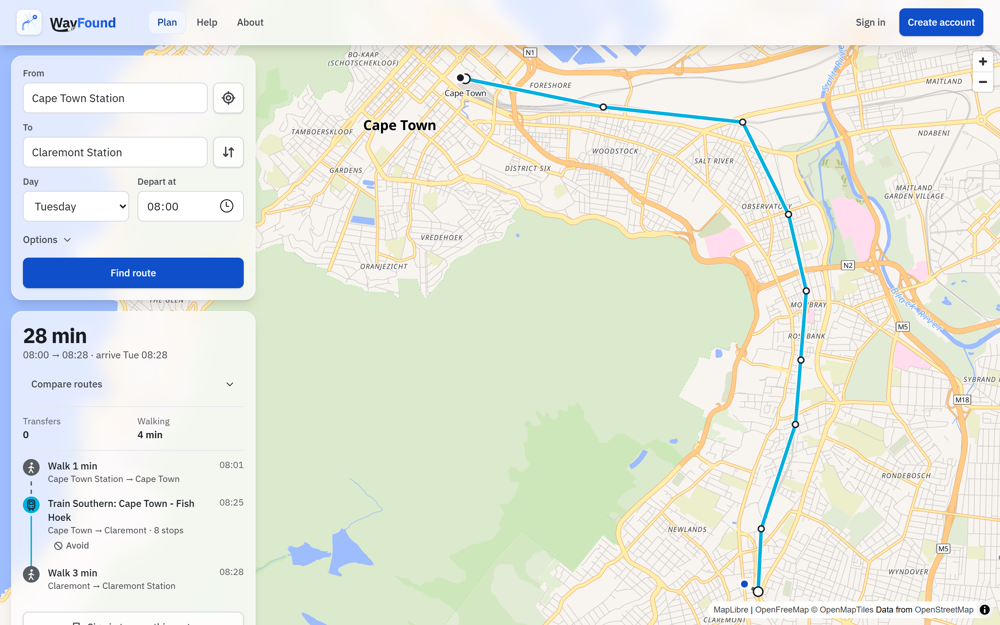
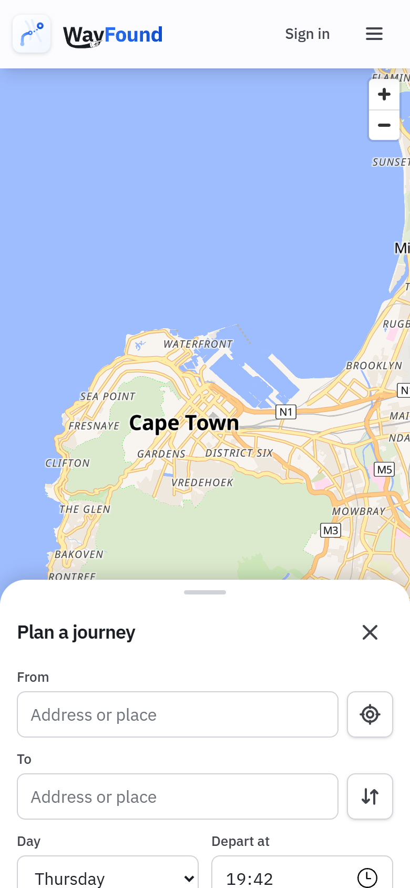
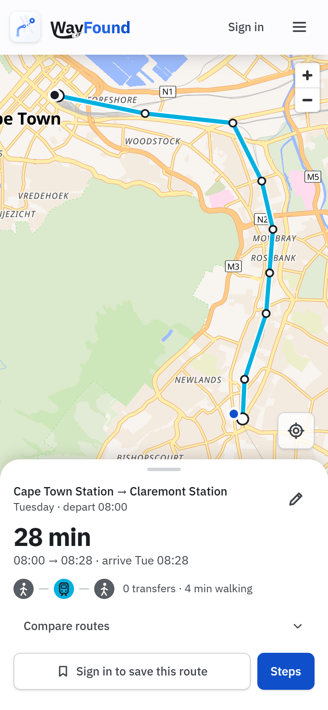
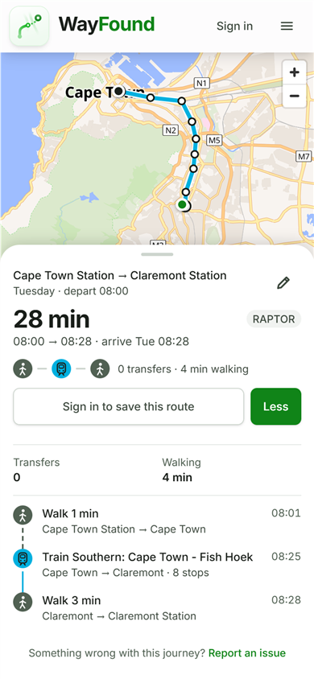
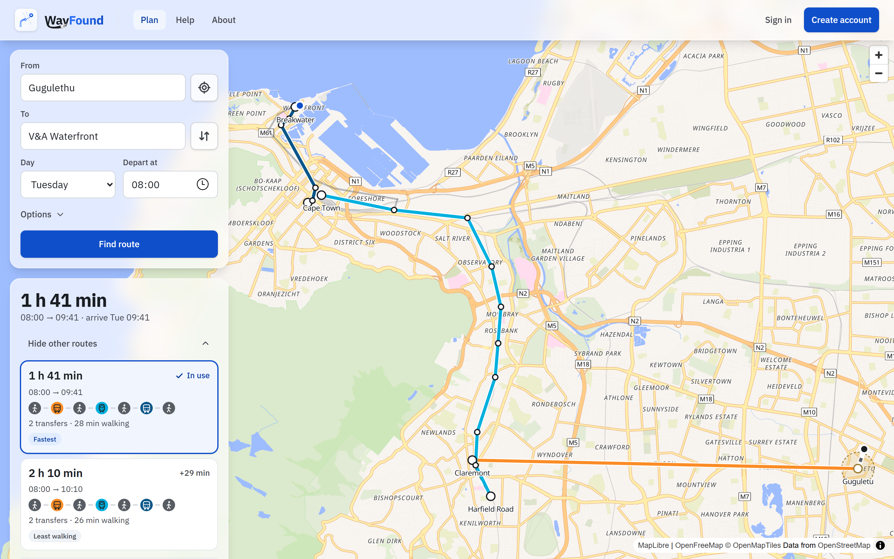
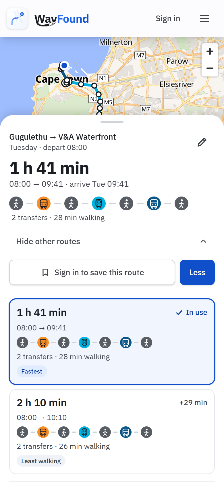
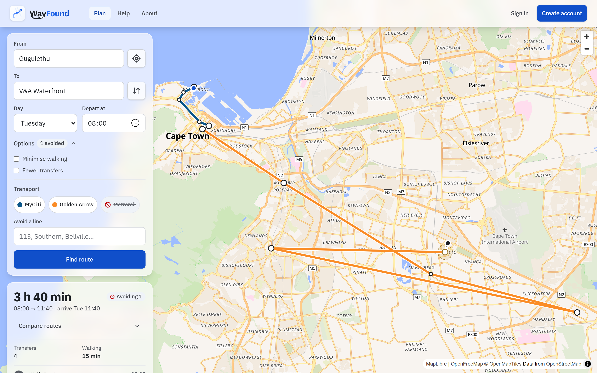
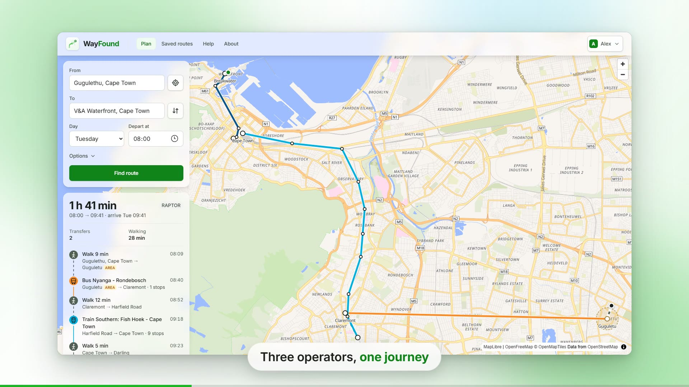

# WayFound

**Cape Town Journey Planner**

A Django and React public transport journey planner for Cape Town, built on the [RAPTOR algorithm](https://www.microsoft.com/en-us/research/wp-content/uploads/2012/01/raptor_alenex.pdf) for fast and efficient transit routing.



On a phone the map fills the screen and the planner is a bottom sheet over it. Once a trip is found the search folds to a one-line summary, and scrolling into the trip grows the sheet to show every step.

| Search | Trip found | Scrolled into the trip |
|---|---|---|
|  |  |  |

---

## Description

WayFound lets users plan trips across Cape Town's buses and trains in one place. It uses **GTFS data** for MyCiTi, Golden Arrow and PRASA Metrorail and the **RAPTOR (Round-Based Public Transit Routing) algorithm** to compute routes between places, considering walking, transfers and travel times.

Unlike traditional shortest-path algorithms (e.g., Dijkstra's), RAPTOR works in **rounds**, making it both **faster and more scalable** for journey planning across large transport networks.

### Features
- Journey planning from any address or place to any other, with the RAPTOR algorithm.  
- Walking to and from stops, transfers, and route preferences (minimise walking, fewer transfers).  
- Avoid transport: switch an operator (MyCiTi, Golden Arrow, Metrorail) off, or search for a single line (a MyCiTi number, a Metrorail line, a Golden Arrow pair of places) and the planner leaves it out. "Avoid" on a ride in the result does the same in one tap, with Undo. If nothing is found because of what is avoided, the result says which one is in the way and offers to allow it. Signed-in riders can keep their choices as defaults.  
- Compare routes: the best route is the default, and "Compare routes" shows up to four more, ranked by arrival time and labelled "Fastest", "Fewest transfers" and "Least walking". Choose any of them as the route in use; a saved route remembers the choice.  
- Legs are shown per operator, each in its own colour (MyCiTi, Golden Arrow, Metrorail) with a walk, bus or train badge.  
- Every ride says which way the vehicle is going, as on its front: "Bus 113 towards Waterfront". MyCiTi's timetable tells its two directions apart only by a suffix (`113-0`, `113-1`), which riders never see, so the planner names the trip's last stop instead.  
- Cape Town only, and says so: the planner and the address search cover the city's transit network (a box around every stop with a few kilometres to spare), and a place outside it gets "outside the area WayFound covers" rather than a misleading "no route".  
- Responsive layout: floating panels over the map on desktop, a map-first bottom sheet on mobile.  
- Small, calm animations: icons that turn, pulse and morph, a route that fades in on the map, and legs that rise in one by one. They are switched off for anyone who prefers reduced motion.  
- Accounts (JWT sign-in with token refresh), saved routes that can be renamed and re-planned, and saved journey preferences.  
- Issue reports, attached to the journey or "no route" result they came from.  
- Django REST API for planning, geocoding, accounts, saved routes, preferences and reports.  
- GTFS repair, cleaning and rebuild scripts for the operator timetables.  

**Comparing routes.** Open "Compare routes" under the trip headline (on a phone it is in the sheet, and opening it expands the sheet) to see the other options as cards. The other routes are drawn faintly on the map, and hovering or focusing a card previews it. Choosing a card makes it the route on the map, in the itinerary, in Save and in a problem report.

| Desktop | Phone |
|---|---|
|  |  |

**Avoiding transport.** Under Options, "Transport" has a switch per operator and a search for single lines. Choices are for that search; "Make these my defaults" (signed in) keeps them in your profile, and Settings has the same controls under "Transport I avoid". Walking is never avoided, so a trip can always fall back to it.



---

## Project Status

- ✅ **Stage 1** – Project Startup  
- ✅ **Stage 2** – Planning and Modelling  
- ✅ **Stage 3** – Prototype  
- 🔄 **Stage 4** – Implementation and Testing (current)  

---

## Badges

[](https://www.python.org/)
[](https://www.djangoproject.com/)
[](https://react.dev/)
[](https://vite.dev/)

---

## Installation

### Requirements
- Python 3.11+  
- Node.js 20.19+ (or 22+) and npm  
- The GTFS dataset in `data/gtfs/` (included in the repository)  
- [Git LFS](https://git-lfs.com/) for the video and zip assets (`*.mp4`, `*.zip`)  

### Setup
```bash
# Clone the repo
git clone https://github.com/EvianMcKeown/WayFound.git
cd WayFound

# Create a virtual environment
python -m venv .venv
source .venv/bin/activate          # Windows: .venv\Scripts\activate

# Install the backend dependencies
pip install -r requirements.txt

# Install the frontend dependencies
cd src/frontend
npm install
cd ../..
```

### Create the database
The SQLite database is **not stored in the repository** (it holds accounts and password hashes), so create your own:
```bash
cd src/backend
python manage.py migrate
python manage.py createsuperuser      # optional: an admin account for /admin
```
The planner reads the GTFS files straight from `data/gtfs/` (`settings.GTFS_FOLDER`), so the database only needs to hold users, saved routes, preferences and issue reports.

### Timetable data
The GTFS feed is not included in the public repository: the timetables belong to MyCiTi (City of Cape Town), Golden Arrow and PRASA, and are not republished without their permission. The scripts in `data/gtfs/scripts/` fetch the operators' published timetables and build the feed into `data/gtfs/` (`myciti_fetch.py`, `prasa_fetch.py`, `gabs_fetch.py`, then the matching `*_build.py`). Without the feed the planner cannot plan journeys, and the tests that need it are skipped.

---

# Usage

### Start the Django development server
```bash
cd src/backend
python manage.py runserver          # API on http://127.0.0.1:8000
```

### Start the frontend server
```bash
cd src/frontend
npm run dev                         # note the port number it prints (usually 5173)
```

### Access the web app
```
http://localhost:5173
```
The planner works without signing in. Saving routes and changing preferences needs an account (create one from **Create account**).

### Production build
```bash
cd src/frontend
npm run build                       # output in dist/
npm run preview                     # http://localhost:4173, forwards /api and /admin to Django on :8000
```
A real host must send unknown paths to `index.html` (the client-side routes `/login`, `/signup`, `/faq`, ...) and forward `/api` to Django. To point a build at another backend, set `VITE_API_BASE_URL` when building.

### Deploying the backend
With no environment variables set, Django runs as a development server (debug pages, any host, a development-only key). For a real server:
```bash
export DJANGO_DEBUG=0
export DJANGO_SECRET_KEY="$(python -c 'import secrets; print(secrets.token_urlsafe(50))')"
export DJANGO_ALLOWED_HOSTS=wayfound.example
export DJANGO_HTTPS=1                       # once it is served over HTTPS: redirect, secure cookies, HSTS
export DJANGO_CORS_ORIGINS=https://...      # only if the frontend is on another origin
python manage.py check --deploy
```
Django refuses to start with `DJANGO_DEBUG=0` and no secret key or allowed hosts.

A hosted copy is a small demo, not a transport service: the app says so in the header, under the planner's button, in the footer and on the About page (`components/DemoNotice.jsx`). The operators' timetables are used for that demo only; the GTFS files are not to be republished until the operators give permission.

### Tests and checks
```bash
pytest algorithm_prototype/tests                  # from the repo root: RAPTOR, GTFS pipeline
cd src/backend && python manage.py test api       # API: planning, accounts, saved routes, preferences, reports, input validation, rate limits
cd src/frontend && npm run lint                   # ESLint
```

### Screenshots of every page
`scripts/screenshot.mjs` drives headless Chrome (or Edge) over the DevTools protocol, with no dependencies, and captures every page and state at 1440 and 390 pixels wide, including the mobile sheet states. It needs Node 22+ and both dev servers running.
```bash
node scripts/screenshot.mjs --out shots                                  # public pages
node scripts/screenshot.mjs --out shots --user NAME --password PASS      # plus the signed-in pages
node scripts/screenshot.mjs --out shots --only planner-result,login      # a few shots
node scripts/screenshot.mjs --out shots --chrome "C:/Program Files (x86)/Microsoft/Edge/Application/msedge.exe"   # Windows
```
Use a throwaway account created through the sign-up page for the signed-in shots. The `planner-wheel-up-down` shot also checks that the mobile sheet grows when scrolled and shrinks again, and fails if it does not.

### Help video
[](src/frontend/public/help-video.mp4)

*An 80 second silent walkthrough with captions: plan a trip across three operators, compare routes, avoid a line and save it, then open it from Saved routes on a phone. Click the picture to play it.*

The video on the Help page (`src/frontend/public/help-video.mp4`, with a poster and English captions) is rendered by script, so it can be re-shot after a design change. `scripts/video/record.mjs` builds the app, plays a storyboard in a browser with a smoothed pointer, camera zooms, captions and finger gestures, and renders it frame by frame at 30 fps with real motion blur (the browser's clock is paused between frames, so it is smooth however slow the machine is; moving frames get extra screenshots inside the shutter, averaged into one). It needs ffmpeg, a Chrome or Edge, Node 22+ and Django running on :8000.
```bash
node scripts/video/record.mjs --chrome "C:/Program Files (x86)/Microsoft/Edge/Application/msedge.exe" --out src/frontend/public
node scripts/video/record.mjs --chrome <browser> --out video-test --fps 15 --blur 1 --only phone    # a quick preview of one scene, without blur
node scripts/video/record.mjs --check    # do storyboard.mjs and script.txt quote the same captions, all short enough?
```
`scripts/video/script.txt` is the script in plain words; `storyboard.mjs` is what is played. Every render checks that their captions agree and prints a timeline of scenes and captions at the end (warning about any caption on screen for under 1.5 s).
It renders on the graphics card (`--gpu nvidia` by default) and stops if the browser ends up on a different one, such as an integrated GPU; use `--gpu software` for the CPU renderer. A fixed clock (Tuesday 08:00) and fixed address suggestions keep every take identical.
The scenes render in parallel, one browser each (about 19 minutes on a GTX 980, against 26 one after another): where they meet, a cut between identical pictures or a dissolve that the final pass blends exactly. `--sequential` plays them in one browser instead.

---

## Project structure

| Path | What is in it |
|---|---|
| `algorithm_prototype/` | RAPTOR, the GTFS reader, and their tests |
| `src/backend/` | Django REST API (planning, geocoding, accounts, saved routes, preferences, reports) |
| `src/frontend/` | React 19, Vite and Tailwind 4 web app |
| `src/journey_planner/` | The earlier Django prototype, kept for reference |
| `data/gtfs/` | Where the GTFS feed is built, and the scripts that fetch, rebuild and repair it (`data/gtfs/scripts/`) |
| `scripts/` | Developer tools (`screenshot.mjs`, and `video/` for the help video) |
| `docs/screenshots/` | Images used in this README |

---

## Design system

The design tokens (a primitive palette, semantic colours with one colour per transport operator, radii, spacing and a type scale) live in `src/frontend/src/index.css`, and the shared components in `src/frontend/src/components/`.

Operator colours: MyCiTi `#0a5689`, Golden Arrow `#fa8c26`, Metrorail `#00b0df`. The brand colour, Cobalt, is kept for actions, links, focus and the logo.

---

## Data and credits

- **Timetables:** published MyCiTi (City of Cape Town, myciti.org.za), Golden Arrow and PRASA Metrorail timetables, converted to GTFS. MyCiTi timetables and stop positions are the City of Cape Town's; their reuse is subject to the City's permission. Stop positions come from Western Cape Government transport data and OpenStreetMap contributors, and were repaired with the scripts in `data/gtfs/scripts/`. The timetable data and the operators' raw files are not published, because the operators own them; the scripts show how the feed is built.
- **Page backdrop:** roads © OpenStreetMap contributors; terrain from NASA SRTM.
- **Map:** [OpenFreeMap](https://openfreemap.org/), © OpenMapTiles, © OpenStreetMap contributors. **Address search:** [Photon](https://photon.komoot.io/) by Komoot, using OpenStreetMap data.
- Timetables can change faster than the feed is updated, and some stops are only known to the nearest area (shown as "area" in a journey). Check with the operator before an important trip.

---

## Security notes

- Without the environment variables above, the settings are for local use only (debug on, any host, any origin, a development key). See "Deploying the backend".
- Every API input is validated, so bad input gets a 400 that says what is wrong, never a server error: coordinates must be in the service area, times 00:00 to 23:59, and search limits in range.
- Rate limits per client: planning 30 a minute, line search 120 a minute, address search 60 a minute, sign-in 10 a minute, sign-up, password changes and issue reports 5 an hour. They are counted in Django's cache, so a server with several processes needs a shared cache (for example Redis).
- The timetable tables (`/api/stops/`, `/api/routes/`, ...) are read-only through the API and paged; they change only through `load_gtfs` and the Django admin.
- Changing your password signs you out on every other device.
- Local databases (`*.sqlite3`) are git-ignored. Never commit one: it holds accounts, password hashes and sessions.
- Personal access tokens belong in your own tool configuration, never in the repository.
